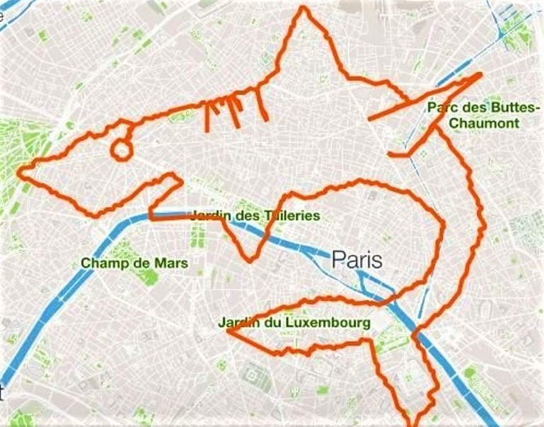

<style type="text/css">
body, td {
   font-size: 12px;
}
code.r{
  font-size: 10px;
}
h1{
  font-size: 24px;
}
h2{
  font-size: 18px;
}
h3{
  font-size: 14px;
}
pre {
  font-size: 11px
}
</style>
{ width=65% }

Les technologies permettent de nos jours de mesurer notre activité physique (sport, sommeil, ou données biologiques simples comme la fréquence cardiaque) à moindre frais. Des capteurs, intégrés à des équipements connectés que l'on porte (les "wearables" : montres connectées ou même smartphones), récoltent des quantités énormes de données liées à notre activité. Ces données sont ensuite digérées par des applications qui vont nous en donner une représentation. De la simple visualisation à la mise en place d'objectifs en termes de performances, ces applications se complexifient et intègrent dorénavant des composantes sociales. Par ailleurs, chaque smartphone a au moins une application de ce type pré-installée.

"Quantified self" ou "personal informatics" sont les termes qui se rapportent à ces pratiques, et font appel à de nombreuses notions : auto-surveillance, amélioration de performances, et "social fitness" (Lupton, 2015).  À quel point les "quantified selfers" ont-ils adopté ces concepts ? Nous allons tenter de mesurer cela à travers l'analyse des commentaires des utilisateurs d'applications de la mesure de soi. Pour faire surgir les concepts du quantified self dans les textes récoltés, nous utiliserons des méthodes de plongement lexical (ou "word embedding"), à savoir les techniques de Word2Vec. Ces modèles de machine learning permettent d'obtenir une représentation vectorielle de chaque mot unique utilisé et d'en déduire les relations sémantiques entre mots (Mikolov et al., 2013). Ces méthodes n'ont encore été que trop peu utilisées dans le domaine des sciences sociales (Kozlowski, Taddi et Evans; 2019).

## La course aux données : des applications bien installées

Nous avons choisi quatre applications destinées à la capture de l'activité physique, en particulier la course à pied : Strava (2009), adidas Running by Runtastic (2009), Runkeeper (2008), et Endomondo (2007). Ces quatre applications se servent de la fonctionnalité GPS du téléphone ou de d'autres appareils connectés afin de récolter diverses données liées à la course (temps, vitesse, élévation, etc.). Ces plate-formes permettent aussi à leurs utilisateurs de récolter d'autres données biologiques s'ils ont le capteur correspondant. Par exemple, elles intègrent le rythme cardiaque à condition que l'utilisateur possède une brassard ou une montre connectés. Chaque plate-forme propose par ailleurs un service d'abonnement, ou premium, qui permet aux utilisateurs d'avoir accès à différents modes de présentation de leurs données, mais aussi des programmes d'entraînement plus poussés.

Les trois applications touchent une population large : Strava, adidas Running by Runtastic et Endomondo comptabilisent chacune plus de 10 millions de téléchargements rien que sur le Google Play Store, tandis que Runkeeper peut se targuer de plus de 50 millions de téléchargements, là aussi sur le store de Google. Tandis que Strava est un "pure player" de la plate-forme, adidas Running by Runtastic, Runkeeper et Endomondo se positionnent dans le domaine des capteurs connectés. Autrefois indépendants, Runtastic a été acheté par adidas, Runkeeper par ASICS, et Endomondo par Under Armour.

## Récolte et préparation des données.

À partir d’une méthode de scraping, nous avons constitué une base de données de plus de 30 000 commentaires provenant des quatre applications. La méthode de scraping consiste dans l’exécution dans la console développeur du navigateur Google Chrome d’un programme écrit en Javascript. Exécuté sur la page web de l’application dans le Google Play Store et sur l'Apple Store, ce code permet l’extraction de l'ensemble des commentaires contenus dans la page.

```{r setup,include=FALSE}
knitr::opts_chunk$set(include=TRUE,echo = TRUE, warning=FALSE,  message=FALSE, cache=TRUE,fig.width = 8)
if (!require(wordVectors)) {
  if (!(require(devtools))) {
    install.packages("devtools")
  }
  devtools::install_github("bmschmidt/wordVectors")
}
library(readr)
library(tidyverse)
library(gridExtra)
library(cleanNLP) 
library(text2vec)
library(reshape2)
library(wordVectors)
library(tsne)
library(ape)

```

Pour toutes les opérations liées à la création et à la manipulation du modèle vectoriel, nous utilisons la librairie `wordVectors` de Benjamin Schmidt, disponible sur le github de ce dernier :
https://github.com/bmschmidt/wordVectors.

Afin de préparer le modèle vectoriel, nous avons rassemblé dans un unique fichier texte l'ensemble des commentaires, après avoir utilisé un module de NLP afin de supprimer les mots vides (stopwords).

La création du modèle vectoriel se fait en deux étapes. Tout d'abord, on appelle la fonction `prep_word2vec` qui permet de nettoyer notre fichier de commentaires. Le paramètre `bundle_ngrams`valant 2, la fonction va regrouper des paquets de 2 mots fréquemment utilisés ensemble. Enfin la fonction `train_word2vec` va créer le modèle proprement dit, et l'inscrire dans un fichier pour éviter de répéter l'opération lors d'usages ponctuels.

```{r lemme0, echo = TRUE, results = "hide"}

if (!file.exists("quantified_self.txt")) {
  #si le fichier n'existe pas, on lit nos données brutes, et on nettoie le corpus des stop words
  cnlp_init_udpipe(model_name = "french")
  runtastic_android<-read_delim("runtastic_final.csv", ";", escape_double = FALSE, trim_ws = TRUE)
  runtastic_ios<-read_delim("runtastic_ios.csv", ";", escape_double = FALSE, trim_ws = TRUE)
  runtastic<-rbind(runtastic_android, runtastic_ios)
  
  strava_android<-read_delim("strava_android.csv", ";", escape_double = FALSE, trim_ws = TRUE)
  strava_ios<-read_delim("strava_ios.csv", ";", escape_double = FALSE, trim_ws = TRUE)
  strava<-rbind(strava_android, strava_ios)
  
  runkeeper_android<-read_delim("runkeeper_android.csv", ";", escape_double = FALSE, trim_ws = TRUE)
  runkeeper_ios<-read_delim("runkeeper_ios.csv", ";", escape_double = FALSE, trim_ws = TRUE)
  runkeeper<-rbind(runkeeper_android, runkeeper_ios)
  
  endomondo<-read_delim("endomondo.csv", ";", escape_double = FALSE, trim_ws = TRUE)
  
  
  obj<-rbind(runtastic, strava, runkeeper, endomondo)
  names(obj)[names(obj)=="Comment"] <- "text" 
  
  Vocab<-cnlp_annotate(obj)
  #filtrage sur les stopwords
  updated_vocab = filter(Vocab$token, !(upos %in% c('ADP','DET','SCONJ', 'PRON')))
  all_comments <- paste(updated_vocab['token'], sep= " ")
  write.table(all_comments, file="comments/comments.txt")
  prep_word2vec(origin="comments",destination="quantified_self.txt",lowercase=T,bundle_ngrams=2)
}
if (!file.exists("quantified_self_vectors.bin")) {model = train_word2vec("quantified_self.txt","quantified_self_vectors.bin",vectors=400,threads=4,window=8,iter=5,negative_samples=0)} else model = read.vectors("quantified_self_vectors.bin")

```


## Exploration du modèle vectoriel : à la recherche du quantified self

Qui sont les quantified selfers ? 
```{r mot1 }
foo<-model %>% closest_to("sportifs",30)
foo$Similarity<-foo[,2]
g1<-ggplot(foo, aes(x=reorder(word, Similarity),y=Similarity))+geom_point(col="black",size=3)+coord_flip()+theme_minimal()+scale_y_log10()
g1
```
On note ici l'ambition des quantified selfers : ce sont des "pros", des sportifs "confirmés", qui cherchent l'"excellence". Remarquons ici les deux sports majoritaires : la course et le cyclisme. 
Au coeur de la notion de quantified self résident les données, la ressource principale de ces plate-formes.

```{r mots2}

foo<-model %>% closest_to("mesures",25)
foo$Similarity<-foo[,2]
g2<-ggplot(foo, aes(x=reorder(word, Similarity),y=Similarity))+geom_point(col="black",size=3)+coord_flip()+theme_minimal()+scale_y_log10()
g2

```

La qualité de la donnée est ici une préoccupation forte des quantified selfers. Ils s'inscrivent dans une pratique rationnelle du sport, aussi toute donnée "erronée", "incohérente", ou tout simplement "fausse" vient contrecarrer leurs plans.

Nous poursuivons en cherchant les mots associés aux "performances".

```{r mots3}
foo<-model %>% closest_to("performance",25)
foo$Similarity<-foo[,2]
g3<-ggplot(foo, aes(x=reorder(word, Similarity),y=Similarity))+geom_point(col="black",size=3)+coord_flip()+theme_minimal()+scale_y_log10()
g3
```
Ce premier résultat nous montre deux choses à proposes du suivi des performances sur ces applications. Premièrement, la mesure de la performance est l'occasion pour le quantified selfer d'entamer une rélfexion sur soi : le jugement et l'observation sont de mise. Ensuite, le besoin de comparer performances présentes et passées est aussi présent ("évolutions", "comparer performances").

Regardons maintenant les mots associés à la motivation.

```{r mot4}
foo<-model %>% closest_to("motivation",25)
foo$Similarity<-foo[,2]
g2<-ggplot(foo, aes(x=reorder(word, Similarity),y=Similarity))+geom_point(col="black",size=3)+coord_flip()+theme_minimal()+scale_y_log10()
g2

```

Dans quel but les utilisateurs sont-ils motivés ? Le dépassement de soi ("dépasser" en troisième position), mais on trouve aussi en filigrane la motivation à mesurer ses performances, les comparer. Toutefois, notons ici que les quantified selfers entretiennent non seulement leur motivation, mais aussi leur forme !

Le quantified self n'est pas une affaire seulement personnelle. Regardons ici les mots associés à "social".

```{r mots5}
foo<-model %>% closest_to("social",30)
foo$Similarity<-foo[,2]
g2<-ggplot(foo, aes(x=reorder(word, Similarity),y=Similarity))+geom_point(col="black",size=3)+coord_flip()+theme_minimal()
g2
```

La composante sociale apparaît ici comme un vecteur important de motivation ("hyper motivant" en quatrième position). Le social fitness est ici à l'honneur : les capacités de réseau social de ces applications de mesure de soi sont en effet mises en avant sur les pages mêmes des différents "app stores". Mais si le partage est une dimension importante du social fitness, le défi et la compétition en sont une composante.

Enfin, le quantified self est fortement lié à la technologie, et au besoin de synchronisation entre capteurs et applications.

```{r mot6}
foo<-model %>% closest_to(c("bluetooth","synchronisation"),25)
foo$Similarity<-foo[,2]
g5<-ggplot(foo, aes(x=reorder(word, Similarity),y=Similarity))+geom_point(col="black",size=3)+coord_flip()+theme_minimal()+scale_y_log10()
g5

tastes = model[[c("bluetooth","synchronisation"),average=F]]
# model[1:3000,] here restricts to the 3000 most common words in the set.
techno = model[1:3000,] %>% cosineSimilarity(tastes)
# Filter to the top 20 sweet or salty.
techno = techno[
  rank(-techno[,1])<25 |
  rank(-techno[,2])<25,
  ]
plot(techno,type='n')
text(techno,labels=rownames(techno), cex=.7)

```

L'aspect matériel jaillit surtout sous la forme de problèmes dans les avis des utilisateurs. Dans un besoin de précision et de confort, les quantified selfers ont recours à une variété de capteurs, dont on retrouve quelques représentants ci-dessus. Les applications doivent être capables de gérer ces différentes sources de données, aussi il n'est pas étonnant de constater le mécontentement de certains.

## Le quantified self en une image

Nous sélectionnons quatre mots qui condense la notion de quantified self : "mesurer", "performance" "motovation" et "social" et nous recherchons pour chacun les 20 mots qui leurs sont le plus proches et les précisent. En utilisant ces quatre mots ( et leurs corrélats), nous pouvons réaliser une première classification de notre corpus selon ces axes, que l'on va représenter sous la forme d'un dendogramm avec `Ape`.

```{r mot7, fig.height=12, fig.width=12}
q_words = c("mesurer", "performance", "social", "motivation")
term_set = lapply(q_words, 
                  function(q_word) {
                    nearest_words = model %>% closest_to(model[[q_word]],25)
                    nearest_words$word
                  }) %>% unlist

subset = model[[term_set,average=F]]

# subset %>%
#   cosineDist(subset) %>%
#   as.dist %>%
#   hclust %>%
#   as.phylo(subset,type="fan") %>%
#   plot

fit <-hclust(as.dist(cosineDist(subset, subset)))
library(ape)


# vector of colors
mypal = c("#556270", "#4ECDC4", "#1B676B", "#FF6B6B", "#C44D58", "seagreen1", "seagreen4", "slateblue4")
# cutting dendrogram in 7 clusters
clus = cutree(fit, 8)
# plot
# Size reflects frequency
plot(as.phylo(fit), type = "cladogram", tip.color = mypal[clus], cex = 0.7, col = "red",no.margin=TRUE)
plot(as.phylo(fit), type="unrooted", tip.color = mypal[clus], cex = 0.7, col = "red",no.margin=TRUE)

```

Sur la partie gauche du dendogramme ressortent les notions sociales de la pratique du quantified self. Camarades et inconnus se retrouvent sur ces plate-formes afin d'y rechercher la motivation nécessaire dans l'évolution de leurs performances. On retrouve aussi pléthore de verbes ayant trait à l'observation, l'évaluation, soulignant encore l'aspect rationnel du quantified self.

On aperçoit, malgré tout, une composante importante du quantified self qui manque : le besoin d'objets connectés, ici smartphone ou montre connectée.

L'analyse TSNE permet de projeter sur un espace à deux dimensions nos vecteurs de mots, permettant ainsi une autre visualisation des similarités.

```{r mot8}
#plot(subset,perplexity=20)

library(Rtsne)

# run Rtsne with default parameters
rtsne_out <- Rtsne(as.matrix(subset), perplexity=5)

# plot the output of Rtsne into d:\\barneshutplot.jpg file of 2400x1800 dimension
#jpeg("d:\\barneshutplot.jpg", width=2400, height=1800)
plot(rtsne_out$Y, t='n', main="le champ lexical: 'mesurer', 'performance', 'social', 'motivation'")
text(rtsne_out$Y, labels=rownames(subset),cex=.7)

```

On parvient à distinguer plusieurs pôles : la dithyrambe; la facilité d'utilisation; un pôle technologie dans la partie haute droite du graphique; dans la partie inférieure, le pôle des activités; sur la droite, l'enregistrement et la localisation des activités; sur la gauche, les performances, la progression et la motivation.

Nous allons reprendre nos thèmes de mesure de performance et de social afin de restreindre l'ensemble des vecteurs représentés. Cependant, comme nous l'avons vu plus haut, la dimension technologique n'apparaissait pas dans notre classification. Aussi, modifions donc les mots choisis de façon à intégrer cet aspect là du quantified self et, pour simplifier, prenons une vision individualiste du quantified self. Une tendance forte de la pratique du quantified self, aperçue dans notre première classification, et que l'on retrouve dans la littérature (par exemple Choe et al, 2014), est celle de la définition d'objectifs.


```{r mot9, fig.height=8, fig.width=8}
#Avec les 3 mots identifiés
q_self = model[[c("analyse", "objectifs", "appareil"),average=F]]

# model[1:2000,] restreint notre classification aux 2000 mots les plus communs
q_self_words = model[1:2000,] %>% cosineSimilarity(q_self)

# On filtre sur les top 20 de chaque catégorie
q_self_words = q_self_words[
  rank(-q_self_words[,1])<20 |
    rank(-q_self_words[,2])<20 | 
    rank(-q_self_words[,3])<20,
  ]

q_self_words %>% 
  prcomp %>% 
  biplot(main="Les mots du quantified self", cex=0.6)
```


Au coeur de l'analyse, on retrouve ici le facteur de motivation que représente la communauté des quantified selfers. C'est cette réflexion devant ses propres performances, mises en perspective avec celles des autres, qui est le facteur de motivation pour se dépasser. Le dépassement intervient dans la définition d'objectifs par l'utilisateur. Enfin, le quantified selfer, en tant qu'être mesuré, s'appuie sur un équipement de plus en plus complexe afin de s'observer, et, in fine, d'affiner son analyse.

## Références

Choe, E.K., Lee, N.B., Lee, B., Pratt, W., Kientz, J.A.(2014) : Understanding quantified-selfers’ practices in collecting and exploring personal data. In: Proceedings of the 32nd Annual ACM Conference on Human Factors in Computing Systems, pp. 1143–1152. ACM (2014) 

Kozlowski, A. C., Taddy, M., & Evans, J. A. (2019). The Geometry of Culture: Analyzing the Meanings of Class through Word Embeddings. American Sociological Review, 84(5), 905–949. https://doi.org/10.1177/0003122419877135

Lupton, D. (2015). Lively data, social fitness and biovalue: The intersections of health self‐tracking and social media. Ssrn Electronic Journal, 411(9), 1–20.

Mikolov, T., Sutskever, I., Chen, K., Corrado, G. S., & Dean, J. (2013). Distributed Representations of Words and Phrases and their Compositionality. In C. J. C. Burges, L. Bottou, M. Welling, Z. Ghahramani, & K. Q. Weinberger (Éd.), Advances in Neural Information Processing Systems 26 (p. 3111–3119). Curran Associates, Inc. http://papers.nips.cc/paper/5021-distributed-representations-of-words-and-phrases-and-their-compositionality.pdf